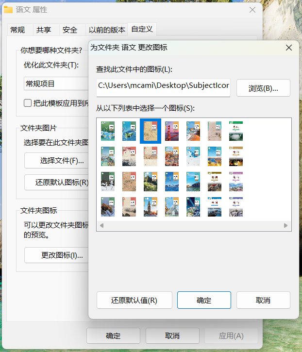

<h2 align="center" style="font-weight: 600">SubjectIcons</h2>

    一个简单的学科图标库

## ✨ 学科

### 高中
1. 语文 统编版
2. 数学 人教A版
3. 英语 人教版
4. 物理 粤教版
5. 化学 人教版
6. 生物 人教版

## 💻 使用

- 可以自行编译
- 也可以下载Release中的dll文件，右键需要更改图标的文件夹，来源选择本项目的dll即可。

## ☑️ Todo

1. 根据需要为大家添加更多科目的图标

欢迎提 Issue 和 Pull request。

## 📜 开源许可

本项目仅供个人学习研究使用，禁止用于商业及非法用途。

基于 [GNU GPL v3](https://www.gnu.org/licenses/gpl-3.0.en.html#license-text) 许可进行开源。

## 🖼️ 截图
